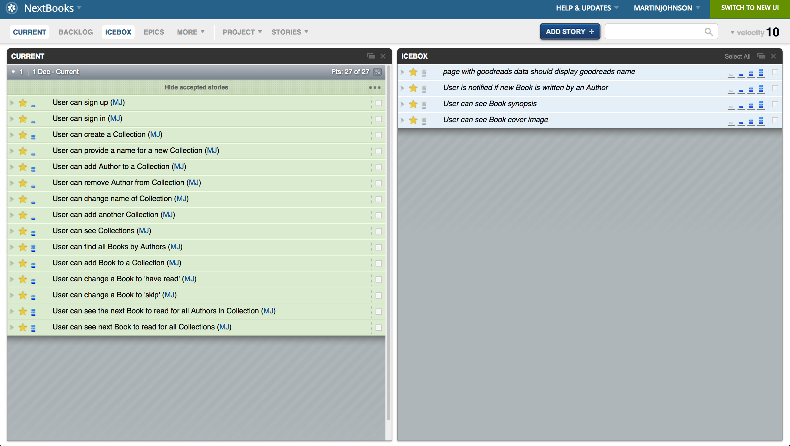
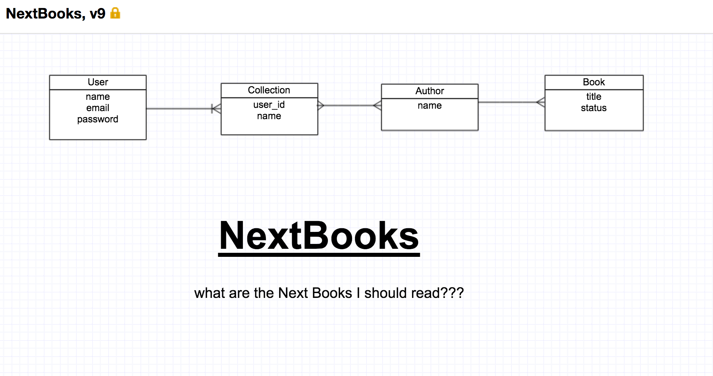

#NextBooks

###Overview

**NextBooks** tells you the Next Books you should read.

The User creates Collections that have Authors. The GoodReads API provides the books by the Author. The User can edit the Status attibute on the Book to choose 'read' or 'skip' instead ot the default 'not read.'

The app shows the oldest book by an Author that you have not read or skipped, so you can read the books in the order in which they were written.

[Visit NextBooks] (https://secure-shore-2618.herokuapp.com/)

NextBooks uses one external API:
Goodreads: https://www.goodreads.com

###User Stories: 

###Technology used:
- Ruby on Rails

###ERD:

### Local Setup

    rake db:create
    bundle install
    rake db:migrate
    rake db:seed
    rails s

    Open the page locally on http://localhost:3000.
    Note that you will need to request access token for the Goodreads API and replace it as appropriate within the code. 
    
=
######Written by Martin Johnson
